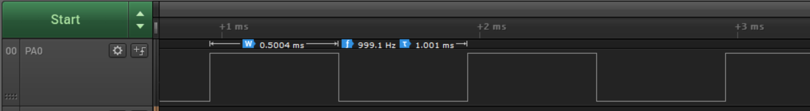

# Generating a Dual-Slope PWM Signal

This code example shows how to initialize the Timer/Counter Type A (TCA) in Dual Slope mode to generate a 16-bit Pulse-Width Modulation (PWM) signal with 1 kHz frequency and 50% duty cycle on a GPIO pin.

## Related Documentation
More details and code examples on the AVR128DA48 can be found at the following links:
- [TB3217-Getting Started with Timer/Counter Type A (TCA)](http://ww1.microchip.com/downloads/en/Appnotes/TB3217-Getting-Started-with-TCA-90003217A.pdf)
- [AVR128DA48 Product Page](https://www.microchip.com/wwwproducts/en/AVR128DA28)
- [AVR128DA48 Code Examples on GitHub](https://github.com/microchip-pic-avr-examples?q=avr128da48)
- [AVR128DA48 Project Examples in START](https://start.atmel.com/#examples/AVR128DA48CuriosityNano)

## Software Used
- MPLAB® X Integrated Development Environment (IDE) 5.40 or newer [(microchip.com/mplab/mplab-x-ide)](http://www.microchip.com/mplab/mplab-x-ide)
- MPLAB® XC8 2.30 or a newer compiler [(microchip.com/mplab/compilers)](http://www.microchip.com/mplab/compilers)
- MPLAB® Code Configurator (MCC) 4.0.1 or newer [(microchip.com/mplab/mplab-code-configurator)](https://www.microchip.com/mplab/mplab-code-configurator)
- MPLAB® Code Configurator (MCC) Device Libraries 8-bit AVR MCUs 2.5.0 or newer [(microchip.com/mplab/mplab-code-configurator)](https://www.microchip.com/mplab/mplab-code-configurator)
- AVR-Dx 1.4.75 or a newer Device Pack

## Hardware Used
- AVR128DA48 Curiosity Nano [(DM164151)](https://www.microchip.com/Developmenttools/ProductDetails/DM164151)

## Setup

The AVR128DA48 Curiosity Nano Development Board is used as test platform.

 

This project requires the following configurations: 

<Configurations>

System clock is 3.33 MHz

TCA0:
- Clock Selection: System clock / 4
- Timer Mode: 16-bit (Normal)
- Requested Timeout: 500 us
- Waveform Generation Mode: Dual Slope PWM, Overflow on BOTTOM
- Channel 0 Enable: Checked
- Channel 0 Duty Cycle: 50%

| Pin |  Configuration    |
| :-: | :---------------: |
| PA0 |   Digital output  |

## Operation

1.  Connect the board to the PC.

2.  Open the Generating_a_Dual-slope_PWM_Signal.X project in MPLAB X IDE.

3.  Set the Generating_a_Dual-slope_PWM_Signal.X project as the main project. Right click on the project in the **Projects** tab and click **Set as Main Project**.

 

4.  Clean and build the Generating_a_Dual-slope_PWM_Signal.X project. Right click on the **Generating_a_Dual-slope_PWM_Signal.X** project and select **Clean and Build**.

 

5.  Select the **AVR128DA48 Curiosity Nano** in the Connected Hardware Tool section of the project settings:

- Right click on the project and click **Properties**;
- Click on the arrow under the Connected Hardware Tool;
- Select the **AVR128DA48 Curiosity Nano** (click on the **SN**), click **Apply** and then click **OK**:

 

6.  Program the project to the board. Right click on the project and then click **Make and Program Device**.

 

## Demo

The PWM signal generated by the TCA0 can be seen in the following image.

 

The waveform period is approximately 1 kHz and its duty cycle is 50%.

## Summary

This code example shows how to initialize the TCA in Dual Slope mode to generate a 16-bit PWM signal with 1 kHz frequency and 50% duty cycle.
