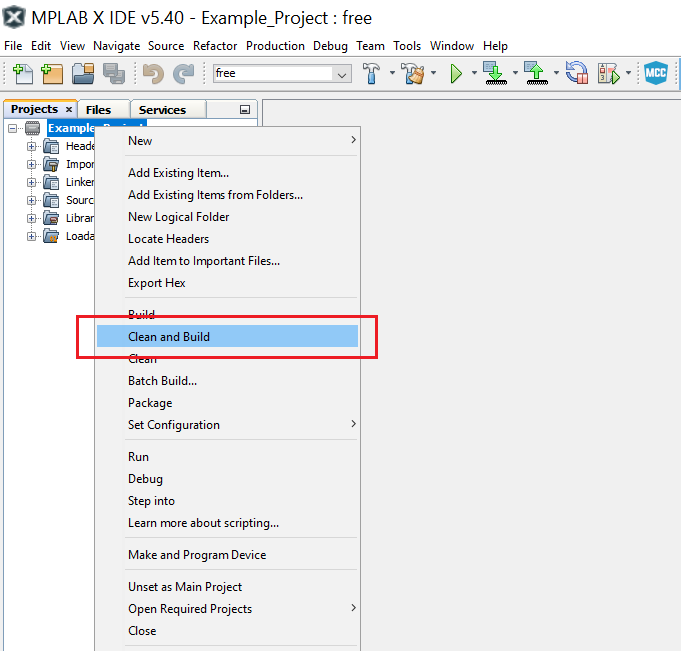

# Using Periodic Interrupt Mode

This use case shows how to initialize the Timer/Counter Type A (TCA) in Single mode to work as a counter. The counter overflows every 250 ms and triggers an interrupt, which toggles a pin.

## Related Documentation
More details and code examples on the AVR128DA48 can be found at the following links:
- [TB3217 - Getting Started with Timer/Counter Type A (TCA)](https://ww1.microchip.com/downloads/en/Appnotes/TB3217-Getting-Started-with-TCA-DS90003217.pdf)
- [AVR128DA48 Product Page](https://www.microchip.com/wwwproducts/en/AVR128DA48)
- [AVR128DA48 Code Examples on GitHub](https://github.com/microchip-pic-avr-examples?q=avr128da48)
- [AVR128DA48 Project Examples in START](https://start.atmel.com/#examples/AVR128DA48CuriosityNano)

## Software Used
- MPLAB® X Integrated Development Environment (IDE) 5.40 or newer [(microchip.com/mplab/mplab-x-ide)](http://www.microchip.com/mplab/mplab-x-ide)
- MPLAB® XC8 2.30 or a newer compiler [(microchip.com/mplab/compilers)](http://www.microchip.com/mplab/compilers)
- MPLAB® Code Configurator (MCC) 4.0.1 or newer [(microchip.com/mplab/mplab-code-configurator)](https://www.microchip.com/mplab/mplab-code-configurator)
- MPLAB® Code Configurator (MCC) Device Libraries 8-bit AVR MCUs 2.5.0 or newer [(microchip.com/mplab/mplab-code-configurator)](https://www.microchip.com/mplab/mplab-code-configurator)
- AVR-Dx 1.4.75 or a newer Device Pack

## Hardware Used
- AVR128DA48 Curiosity Nano [(DM164151)](https://www.microchip.com/Developmenttools/ProductDetails/DM164151)

## Setup

The AVR128DA48 Curiosity Nano Development Board is used as test platform.

 

This project requires the following configurations: 

<Configurations>

System clock is 3.33 MHz

Global Interrupts Enabled

TCA0:
- Clock Selection: System clock / 256
- Timer Mode: 16-bit (Normal)
- Count direction: Up
- Requested Timeout: 250 ms
- Enable Overflow Interrupt

| Pin |  Configuration    |
| :-: | :---------------: |
| PA0 |   Digital output  |

## Operation

1.  Connect the board to the PC.

2.  Open the Using_Periodic_Interrupt_Mode.X project in MPLAB X IDE.

3.  Set the Using_Periodic_Interrupt_Mode.X project as the main project. Right click on the project in the **Projects** tab and click **Set as Main Project**.

 

4.  Clean and build the Using_Periodic_Interrupt_Mode.X project. Right click on the **Using_Periodic_Interrupt_Mode.X** project and select **Clean and Build**.

 

5.  Select the **AVR128DA48 Curiosity Nano** in the Connected Hardware Tool section of the project settings:

- Right click on the project and click **Properties**;
- Click on the arrow under the Connected Hardware Tool;
- Select the **AVR128DA48 Curiosity Nano** (click on the **SN**), click **Apply** and then click **OK**:

 

6.  Program the project to the board. Right click on the project and then click **Make and Program Device**.

 

## Demo

The digital value of the PA0 pin toggled by the TCA0 overflow interrupt can be seen in the following image.

 

The value of the pin changes every 250 ms.

## Summary

This code example shows how to initialize the TCA as a counter to trigger an overflow interrupt every 250 ms, toggling a GPIO in the interrupt service routine.
